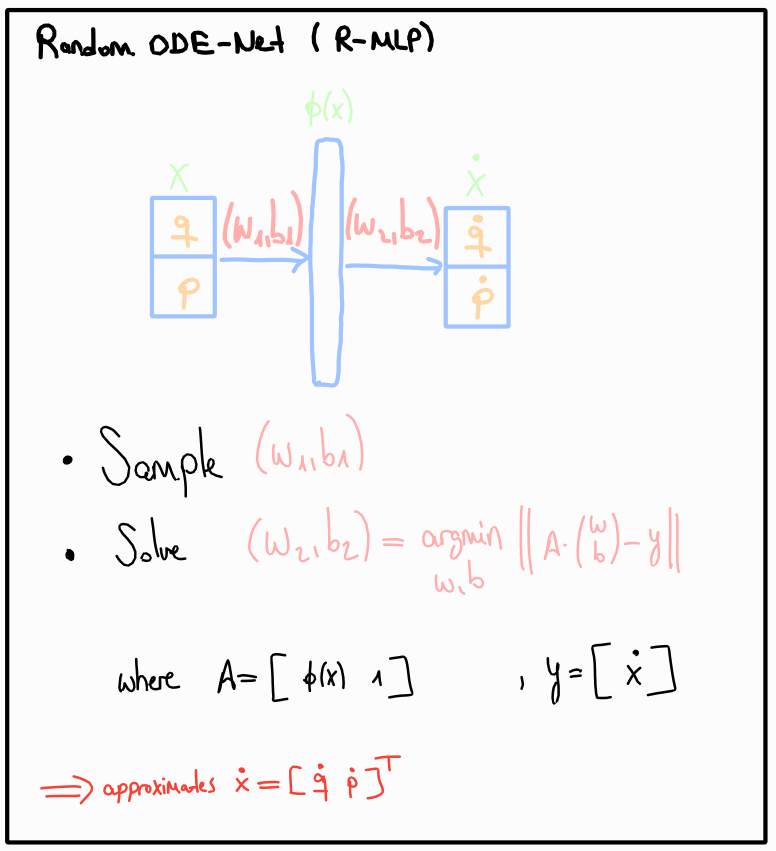
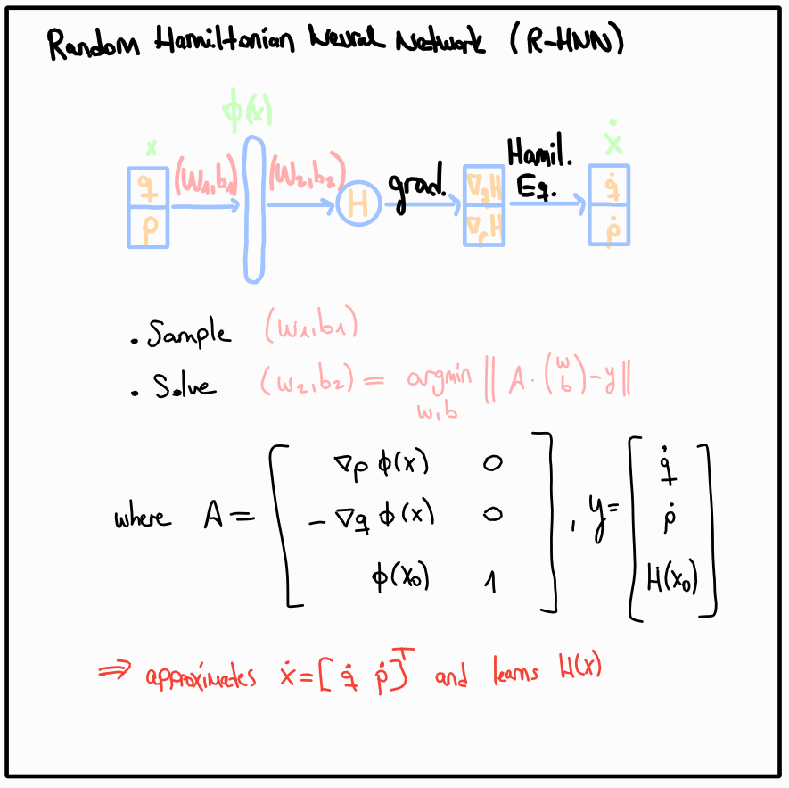

Models
======

Available models are:
- **MLP**: ODE-Net, directly approximates `q_dot` and `p_dot`. [paper](https://arxiv.org/abs/1806.07366)
- **HNN**: Hamiltonian neural network approximates `H`, then `q_dot` and `p_dot` are recovered
using automatic differentiation and Hamilton's equations. [paper](https://arxiv.org/abs/1906.01563v2)

All the models are available in sampled form. Sampled models have the **S-** prefix, which stands
for **Sampled**. In this case, the model's hidden layer parameters are sampled, and the network's
last layer is set using the least-squares solution. Different sampling options and resampling
using approximate values are available for the SWIM method. [paper](https://arxiv.org/abs/2306.16830)

Here are the sampled models with their architecture illustrations:
- **Sampled-MLP**: 
- **Sampled-HNN**: 

---

Setup
=====

Create the conda environment:
```sh
conda env create --file=environments.yml
```

Then activate it with `conda activate s-hnn`.

---

Examples
========

FIXME
After setting up the conda environment, you can use the bash script `main` located at the root of the
project. Run `./main --help` for more information on the model parameters.
- training a traditional network: `./main --target single_pendulum --model {MLP,HNN}`
- training a sampled network: `./main --target single_pendulum --model {S-MLP,S-HNN}`

Experiments
===========

- All the experiment results  listed in our paper, including all the trained models, are stored under `/experiments` as pickle files.
- In order to reproduce the experiments, refer to the scripts `/src/*experiment.py`.
- In order to analyze the results we prepared notebooks located at the root of the project `/analyze-*.ipynb`.
- The scripts `/batch*.sh` are used to conduct the experiments listed in our paper in a cluster environment.
